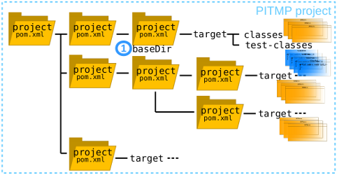

# PitMP: Maven plugin to handle multi module projects for PiTest
[](https://maven-badges.herokuapp.com/maven-central/eu.stamp-project/pitmp-maven-plugin)

## Table of contents
  - [What is PitMP?](#what-is-pitmp)
  - [How does PitMP work?](#how-does-pitmp-work)
  - [PitMP Output](#pitmp-output)
  - [Running PitMP on your project](#running-pitmp-on-your-project)
  - [Releases](#releases)
  - [Tested on](#tested-on)

## What is PitMP?
PitMP (PIT for Multi-module Project) is a Maven plugin able to run PIT on multi-module projects.
PIT is a mutation testing system for Java applications, which allows you to evaluate
the quality of your test suites.

To know more about PIT: http://pitest.org

## How does PitMP work?

PIT takes a test suite, a set of classes to be mutated and a set of mutation operators
and computes a line coverage and a mutation coverage:    


PIT mutates only the classes defined in the same module than the
test suite:    


PitMP runs PIT on every test suite, mutating classes of all dependencies of modules
located in the same project tree:    
  
then:  
  
etc...

PitMP just extends PIT, it doesn't rewrite any feature, so all PIT's properties can
be used.
PitMP runs test suite as PIT does, just extending the list of classes to be
mutated to the whole project tree, instead of mutating only the classes of
the test suite module.


## PitMP Output

PIT produces a report that includes:
* a summary of line coverage and mutation coverage scores:

* a detail report for each class combining line coverage and mutation coverage
information:
  
*Light green shows line coverage, dark green shows mutation coverage.*  
*Light pink show lack of line coverage, dark pink shows lack of mutation coverage.*


## Running PitMP on your project

### Install the plugin
Since 1.1.4 PitMP is available on Maven Central, so this step is required only
for versions before 1.1.4.
```
git clone https://github.com/STAMP-project/pitmp-maven-plugin.git
cd pitmp-maven-plugin
mvn install
```

### Run PitMP

* Go to the project on which you want to apply PIT

* Add to your root project pom.xml, in the section \<plugins\>:
```
  <plugin>
    <groupId>eu.stamp</groupId>
    <artifactId>pitmp-maven-plugin</artifactId>
    <version>version.you.want</version>
    <!-- list all the packages of the project that contain classes you want to be mutated    -->
    <configuration>
      <targetClasses>
        <param>a.package.of.classes*</param>
        <param>another.package.of.classes*</param>
      </targetClasses>
    </configuration>
    <dependencies>
      <dependency>
        <groupId>org.pitest</groupId>
        <artifactId>pitest-maven</artifactId>
        <version>pitest.version</version>
      </dependency>
    </dependencies>
  </plugin>
```
* Compile your project
```
mvn install
```
* Run PIT on your multi module project :-)
```
mvn pitmp:run
```

### PitMP properties

* targetModules: to run PIT only on specified modules    
  You can use the property "targetModules" in the pom.xml:
  ```
          <targetModules>
            <param>yourFirstModule</param>
            <param>anotherModule</param>
          </targetModules>
  ```
  or on the command line, use:
  ```
  mvn "-DtargetModules=yourFirstModule,anotherModule" pitmp:run
  ```
  Running PitMP from a module directory will NOT work.
* skippedModules: to run PIT only on specified modules    
  You can use the property "skippedModules" in the pom.xml:
  ```
          <skippedModules>
            <param>aModuleToSkip</param>
            <param>anotherModuleToSkip</param>
          </skippedModules>
  ```
  or on the command line, use:
  ```
  mvn "-DtargetModules=aModuleToSkip,anotherModuleToSkip" pitmp:run
  ```

## Running Descartes

If you want to run Descartes, use the v1.0.1. Descartes supports only PiTest v1.2.0 for now.  
To run Descartes, add to your root project pom.xml, in the section \<plugins\>:
```
  <plugin>
    <groupId>eu.stamp</groupId>
    <artifactId>pitmp-maven-plugin</artifactId>
    <version>version.you.want</version>
    <!-- list all the packages of the project that contain classes you want to be mutated    -->
    <configuration>
      <targetClasses>
        <param>a.package.of.classes*</param>
        <param>another.package.of.classes*</param>
      </targetClasses>
      <mutationEngine>descartes</mutationEngine>
      <mutators>
        <mutator>void</mutator>
        <mutator>null</mutator>
        <mutator>true</mutator>
        <mutator>false</mutator>
        <mutator>empty</mutator>
        <mutator>0</mutator>
        <mutator>1</mutator>
        <mutator>(byte)0</mutator>
        <mutator>(byte)1</mutator>
        <mutator>(short)1</mutator>
        <mutator>(short)2</mutator>
        <mutator>0L</mutator>
        <mutator>1L</mutator>
        <mutator>0.0</mutator>
        <mutator>1.0</mutator>
        <mutator>0.0f</mutator>
        <mutator>1.0f</mutator>
        <mutator>'\40'</mutator>
        <mutator>'A'</mutator>
        <mutator>""</mutator>
        <mutator>"A"</mutator>
      </mutators>
    </configuration>
    <dependencies>
      <dependency>
        <groupId>org.pitest</groupId>
        <artifactId>pitest-maven</artifactId>
        <version>1.2.0</version>
      </dependency>
      <dependency>
        <groupId>fr.inria.stamp</groupId>
        <artifactId>descartes</artifactId>
        <version>0.2-SNAPSHOT</version>
      </dependency>
    </dependencies>
  </plugin>
```

For complete instructions about Descartes see the [Descartes github](https://github.com/STAMP-project/pitest-descartes).

For an example of multi module project using PitMP see the [dnoo github](https://github.com/STAMP-project/dnoo).

## Releases

* v1.0.1
  - tested with PIT v1.2.0 and Descartes v0.2-SNAPSHOT
  - tested with PIT v1.2.3
* v1.1.0, pitmp-maven-plugin-1.1.4
  - tested with PIT v1.3.1

## Tested on

* [dhell project on github](https://github.com/STAMP-project/dhell)
* [dnoo project on github](https://github.com/STAMP-project/dnoo)
* [xwiki-commons project on github](https://github.com/xwiki/xwiki-commons)
* [xwiki-rendering project on github](https://github.com/xwiki/xwiki-rendering)

* Ubuntu 16.04.4 LTS

Feedbacks are welcome ! :-)
